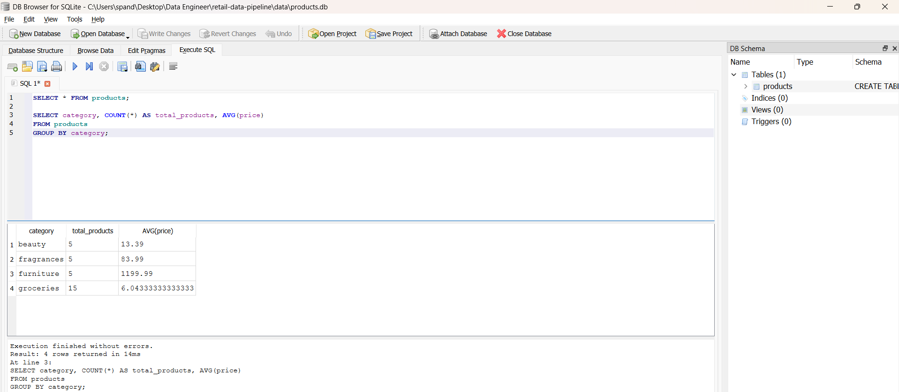

# End-to-End Data Engineering Pipeline (API to SQLite)

🚀 **Project Level:** Level 1 (Foundational Data Engineering Pipeline)

---

## 📖 Overview

This project demonstrates a complete end-to-end data engineering pipeline that ingests data from external APIs, transforms it into a structured format, enriches it by merging multiple data sources, and loads it into a relational database for analytical querying and machine learning.

---

## ⭐ Project Highlights

- Built a modular, config-driven data pipeline using Python  
- Integrated multiple data sources (products + users API)  
- Performed data cleaning, transformation, and merging  
- Implemented centralized logging for monitoring and debugging  
- Stored processed data in SQLite for querying  
- Added a machine learning layer for predictive analysis  

---

## 🎯 Objective

To design and implement a scalable data pipeline that:
- Extracts data from external APIs  
- Transforms semi-structured JSON into structured data  
- Merges datasets to create enriched data  
- Loads processed data into a database  
- Enables SQL-based analysis and basic ML predictions  

---

## 🏗️ Architecture

The pipeline follows a modular multi-stage architecture:

1. **Data Ingestion**
   - Fetches product and user data from REST APIs

2. **Raw Data Storage**
   - Stores JSON files with timestamps

3. **Data Transformation**
   - Cleans and structures product data

4. **Data Enrichment**
   - Merges product and user datasets

5. **Data Storage**
   - Saves processed data to CSV and SQLite

6. **Analytics & ML**
   - Runs SQL queries and trains a classification model

---

## ⚙️ Features

- API-based data ingestion using Python  
- Multi-source data integration  
- Data transformation and cleaning using Pandas  
- Data merging and enrichment  
- Storage in SQLite database  
- SQL-based querying for analysis  
- Centralized logging system  
- Machine learning integration  

---

## 🛠️ Tech Stack

- **Programming:** Python  
- **Data Processing:** Pandas  
- **Database:** SQLite  
- **Data Source:** REST API  
- **ML Library:** Scikit-learn  
- **Config Management:** YAML  

---

## 📁 Project Structure

# Project Structure

```text
RETAIL-DATA-PIPELINE/
├── config/
│   └── config.yaml          # Pipeline & database configurations
├── data/                    # (Ignored) Raw & processed data storage
│   ├── processed/
│   │   └── products_cleaned.csv
│   ├── raw/
│   └── products.db
├── logs/                    # (Ignored) Runtime error & pipeline logs
│   ├── error.log
│   └── pipeline.log
├── output/                  # Visualizations & query results
│   ├── cleaned_dataset.png
│   └── sql_query_output.png
├── scripts/                 # ETL and Processing logic
│   ├── __init__.py
│   ├── api_ingestion.py
│   ├── config_loader.py
│   ├── fetch_data.py
│   ├── load_to_db.py
│   ├── logger.py
│   ├── ml_model.py
│   ├── run_pipeline.py
│   └── transform_data.py
├── .env                     # (Ignored) Environment variables & credentials
├── .gitignore               # Excludes data/, logs/, __pycache__/, etc.
├── README.md                # Project documentation
└── requirements.txt         # Python dependencies
```
---

## ▶️ How to Run

1. Install dependencies:
   ```bash
   pip install -r requirements.txt
   ```

2. Run the pipeline:
```bash
python -m scripts.run_pipeline
```
----
## 📊 Sample Output
SQL Query
```sql
SELECT category, AVG(price) as avg_price 
FROM products 
GROUP BY category;
```

📸



## 🤖 Machine Learning
- Built a Logistic Regression model
- Predicted high-value products
- Features used: price, rating, stock
- Created target variable based on price threshold
- Achieved basic classification accuracy

-----

## 🧠 Design Decisions
- Used SQLite for simplicity and portability in a local setup
- Simulated relationships between datasets for data enrichment
- Used modular scripts for scalability and maintainability
- Implemented config-driven design for flexibility

-----

## 📌 Key Learnings
- Built a batch data ingestion pipeline using external APIs
- Transformed semi-structured JSON data into structured format
- Merged multiple datasets for richer insights
- Implemented logging and error handling
- Designed an end-to-end data pipeline with modular architecture
- Integrated machine learning into a data pipeline

-----

## 🔄 Future Improvements
- Integrate cloud storage (Azure Data Lake / AWS S3)
- Replace SQLite with production-grade databases (MySQL / Snowflake)
- Implement pipeline scheduling (Airflow / Cron)
- Add data validation and monitoring
- Enhance ML model with better features and evaluation
